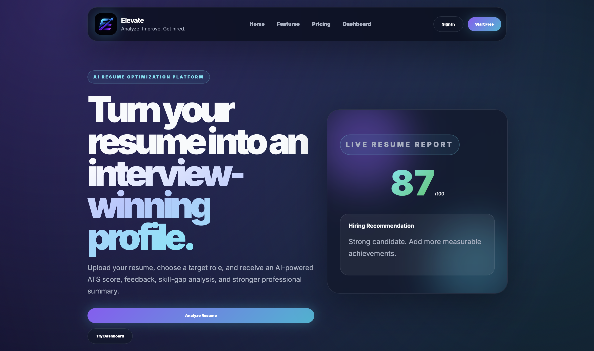
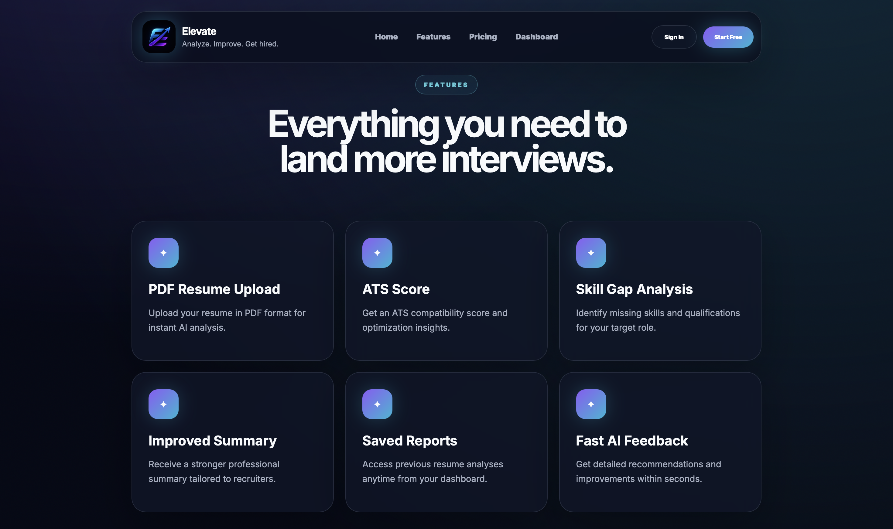
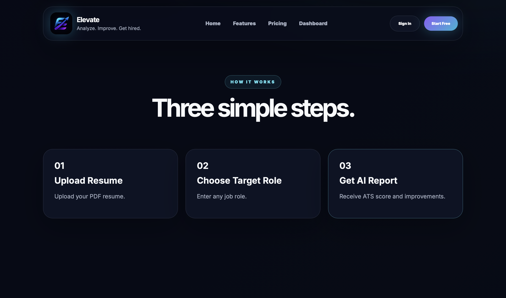
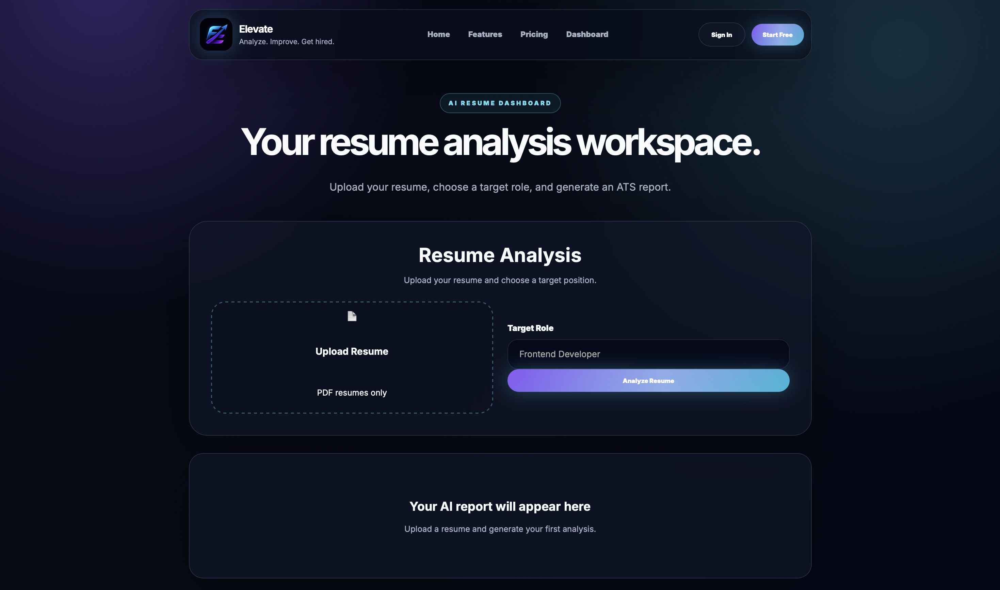
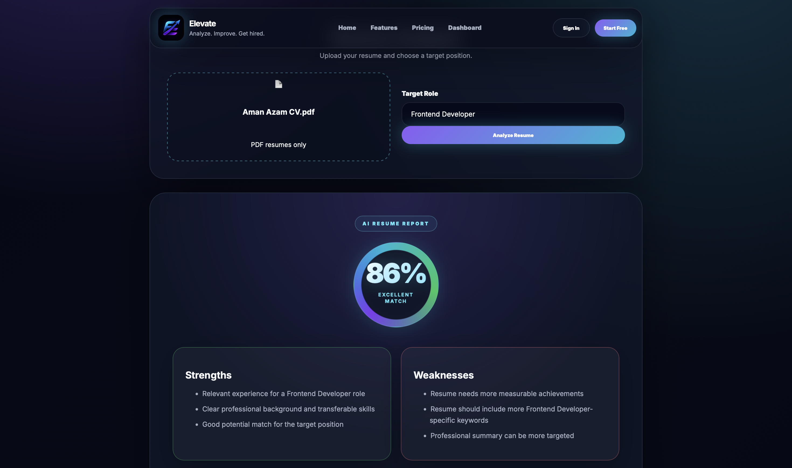
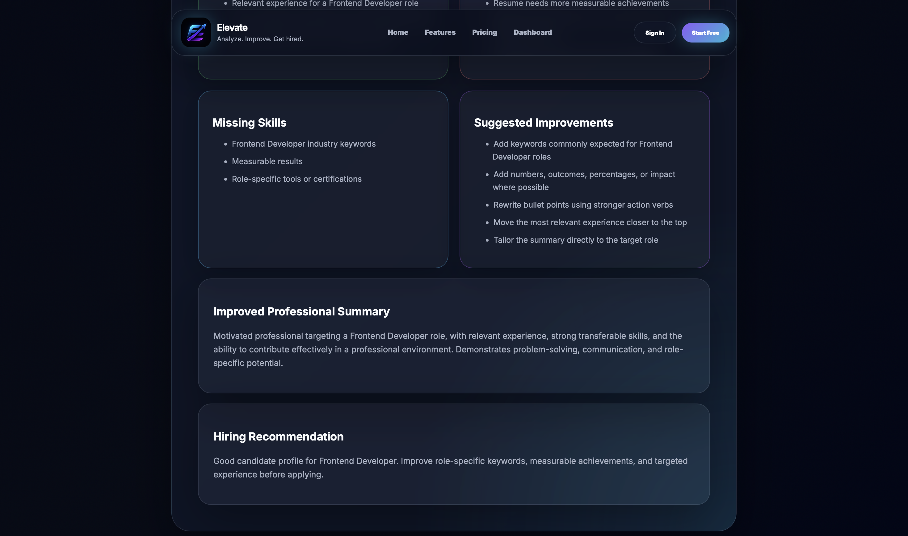
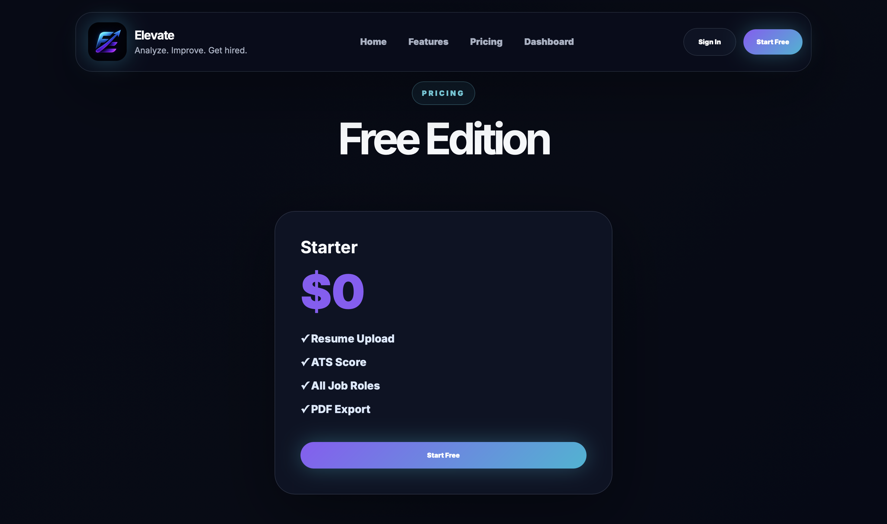
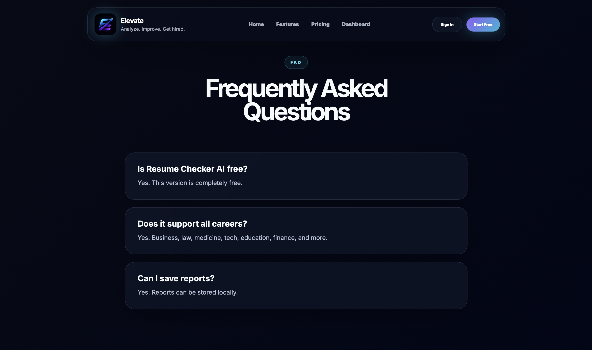
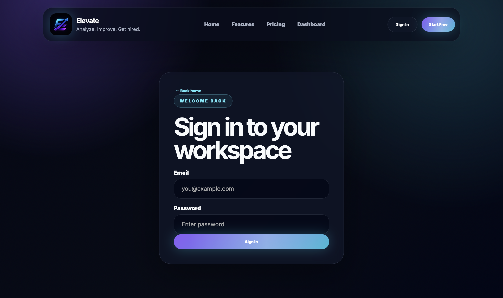
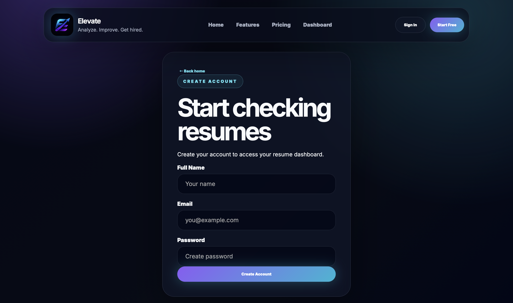

# Elevate AI

AI-powered resume analysis and ATS optimization platform that helps job seekers improve their resumes through ATS scoring, skill-gap analysis, hiring recommendations, and AI-generated improvement suggestions.

## Live Demo

https://elevate-career.vercel.app

## GitHub Repository

https://github.com/Aman-Azam/elevate-ai

---

## Features

- ATS Resume Scoring
- Skill Gap Analysis
- AI-Powered Resume Feedback
- Hiring Recommendations
- Professional Summary Enhancement
- PDF Resume Upload
- Role-Based Analysis
- Responsive Design
- Resume Report Dashboard

---

## Screenshots

### Home Page



### Features



### How It Works



### Dashboard



### ATS Analysis Report



### Detailed Recommendations



### Pricing



### FAQ



### Sign In



### Sign Up



---

## Tech Stack

- React
- Vite
- JavaScript
- Google Gemini API
- CSS3
- Vercel

---

## Installation

Clone the repository:

```bash
git clone https://github.com/Aman-Azam/elevate-ai.git
```

Move into the project:

```bash
cd elevate-ai
```

Install dependencies:

```bash
npm install
```

Create a `.env` file:

```env
VITE_GEMINI_API_KEY=YOUR_API_KEY
```

Run locally:

```bash
npm run dev
```

Build for production:

```bash
npm run build
```

---

## Project Structure

```text
elevate-ai
├── public
├── src
├── Screenshots
├── README.md
├── package.json
└── vite.config.js
```

---

## Author

**Aman Azam**

GitHub: https://github.com/Aman-Azam

LinkedIn: https://www.linkedin.com/in/amanazam/

Live Demo: https://elevate-career.vercel.app